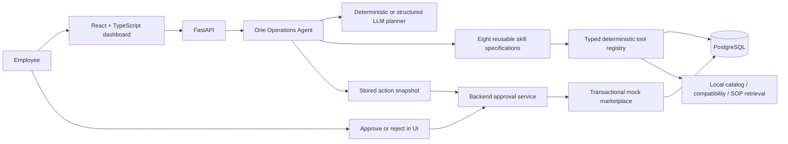

# Architecture

The planner has no database handle or tools. It returns validated intent/entities. The
orchestrator selects skill procedures and invokes typed tools. There are no sub-agents.
The deterministic provider supports the documented English and Chinese workflow examples.
An optional OpenAI-compatible provider performs structured classification; it does not supply
fitment, price, SQL, arbitrary tool names, or approval authorization.

Tools are independently callable through the Python registry and return `ToolResult` envelopes
with `data`, `evidence` and `synthetic`. Tools validate `ToolInput` at invocation. The skill
registry restricts which tools may execute. SKU identifiers are generated only for intake
drafts and never presented as newly discovered OEM identifiers.

Inventory/order/current listing state lives in SQL. Reference data lives in local JSON and SOP
documents behind a retrieval interface. Metadata and keyword retrieval is the default;
there is no external vector database, embedding key or paid dependency.

## Transactions and approval

Draft stock has status `draft`, excluded from available quantities. Each intake gets a fresh
SKU. Duplicate matches remain untouched. A pending approval stores the exact listing facts,
description, price, marketplace and inventory ID. Approval uses an atomic conditional SQL
update from pending to executing. The service rechecks the entire snapshot and inventory
state, writes the mock record and marks approval consumed in one transaction. A concurrent
request gets HTTP 409. Unique constraints on marketplace listing/approval IDs provide a
second guard. A simulated marketplace failure rolls the transaction back, records an error
trace, and leaves approval pending for an explicit retry.

The mock integration deliberately writes in the same database transaction. Real external
publishing would require an outbox, an external idempotency key and reconciliation, and is
not implemented. There is no real marketplace network client.

An agent run is first recorded, then executes its tools in one transaction. On a tool failure,
unfinished drafts roll back and the run records the failure with sanitized traces. If the
database itself is unavailable, the API returns 503; it cannot promise durable failure logs
while storage is inaccessible.

## Deployment boundaries and deviations

- Implementation resides directly in the requested workspace, without a redundant nested folder.
- FastAPI endpoints live in `backend/app/main.py`; compact modules group closely related code.
- SQLAlchemy + Alembic migrations support PostgreSQL; isolated SQLite is used for fast tests.
- The reference catalog is immutable local synthetic JSON; business state is PostgreSQL.
- The main run API is synchronous (bounded provider timeout). No fake streaming or simulated
  thinking indicator is used; the UI shows a loading state then the actual recorded timeline.
- Chat approvals are never accepted. HTTP review actions require JSON and bind to a stored
  action; no session authentication is included in this loopback-only demo.
- Inventory deletion, bulk public price changes and arbitrary state mutations are intentionally
  unavailable. Published-price update/deactivate mock methods exist but have no exposed proposal
  endpoint. They still require an executing approval for the exact action.
- Full production identity, RBAC, queueing, tenant isolation and real fitment licensing remain
  future deployment work. Docker binds host services to loopback.

