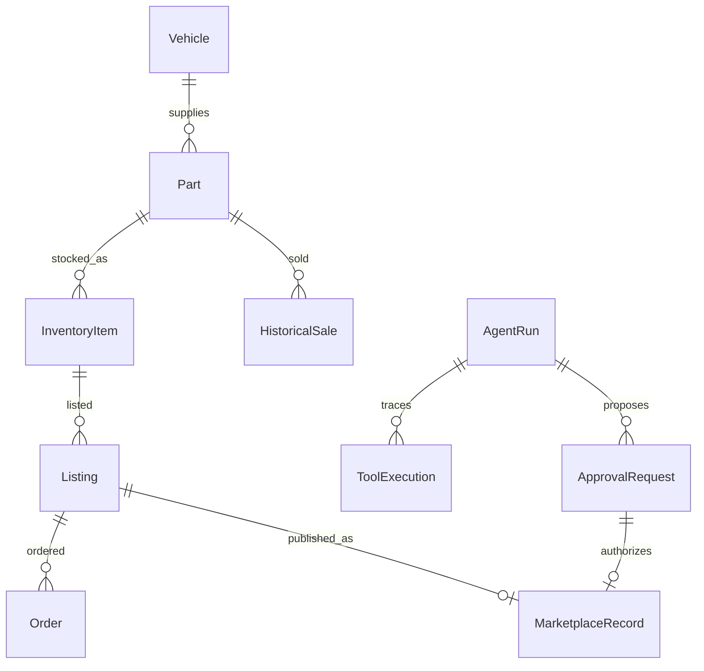

# Data model

Models include all fields in the implementation specification. Money uses SQL Numeric(10,2).
OEM numbers, VINs and internal SKUs are unique. Inventory quantity and asking price have
nonnegative constraints. Foreign keys enforce relational integrity. Inventory condition is
stored per stock item as well as the source catalog part, so draft intake condition is retained.

AgentRun stores explicit JSON state and a structured final response. ToolExecution records skill,
name, sanitized input/output, status, milliseconds, summary and error class. ApprovalRequest
stores immutable proposed action facts, status, created/resolved times and resolution. The mock
marketplace table enforces unique listing and approval IDs.

Seed: 5 synthetic vehicles, 41 catalog parts, 41 inventory records (including two exact BMW
alternator records and one near duplicate), 108 historical sales, 3 example listings and 3 orders.
Toyota sensor has no stock/history. Sensor fitment is deliberately unknown. All values are
synthetic. Seed is idempotent on a previously initialized demo database, not a production upsert.

Run `alembic upgrade head` before seed. Migrations are explicit versioned operations generated
from the schema, not runtime `create_all`. Tests use fresh isolated databases.

